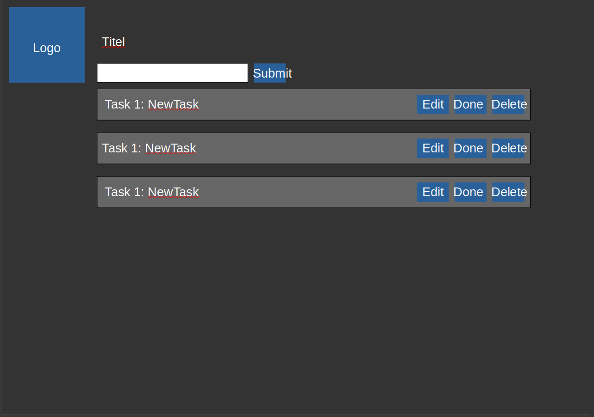
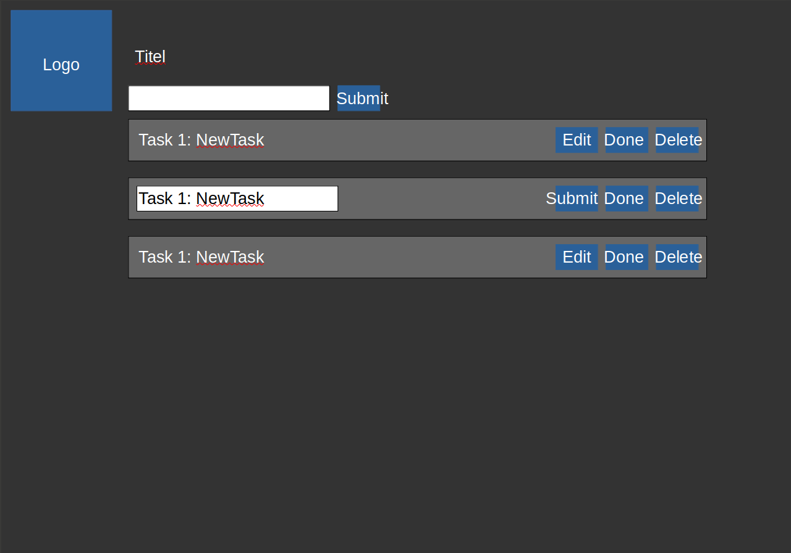

# User Stories

## Persistenz 

**Wer:** User  
**Was:** Langzeit Tasks Speichern  
**Warum:** Dammit Wichtige ToDo's nicht Vergessen werden  

| Akzeptanzkriterien |  
| :--- |  
| 1. Der User Behält bei einem neustart des Programmes seine toDos |
| 2. Die ToDo's sind vor einem Programm absturz geschützt | 
| 3. Die Daten isn in einer SQl Datenbank Gespeichert |
| 4. Tasks sind Lokal Gespeichert |

## Ranking 

**Wer:** User  
**Was:** Will Seine Tasks Ordnen  
**Warum:** Dammit Wichtigkeit und Organisation  eingehalten werden können  

| Akzeptanzkriterien |  
| :--- |  
| 1. Der User Kann die ToDo's Ordnen |
| 2. Der User sieht das Ranking der ToDo's | 
| 3. Der User Kann die ToDo's mit Drag&Drop Verschieben |
| 4. Die ToDo's sind Scrollbar |

## Design 

**Wer:** Marketing 
**Was:** Logo anzeigen  
**Warum:** Das Produkt soll eine Klare Marke Darstellen  

| Akzeptanzkriterien |  
| :--- |  
| 1. Das Logo ist Oben links gut sichtbar |
| 2. Das Logo ist via vector grafics integriert | 
| 3. Das logo ist nicht Kopierbar |
| 4. Das logo entspircht Design standarts|

## Error handling

**Wer:** User  
**Was:** Backend nicht gestartet  
**Warum:** Um auf ein nicht funktionierenden teil hinzuweisen  

| Akzeptanzkriterien |  
| :--- |  
| 1. User kann die Frontend andwendung starten und über einen Browser erreichen. |
| 2. User kann einen neune Task erstellen. | 
| 3. Nach dem der Task abgeschickt wurde, kommt die Fehlermeldung das keine antwort vom Backend kommt (Not running). |
| 4. Nach einschalten des Backends verschwindet die Fehlermeldung nach aktualisierung des Browsers. |

**Wer:** User  
**Was:** Fehlermeldung bei fehlerhaften Datenverbindungen anzeigen  
**Warum:** Um den User über Verbindungsprobleme zu informieren  

| Akzeptanzkriterien |  
| :--- |  
| 1. Der User kann die Frontend-Anwendung starten und über einen Browser erreichen. |
| 2. Der User kann auf Seiten zugreifen, die Daten vom Backend benötigen. |
| 3. Bei einer fehlerhaften Datenverbindung (z.B. Netzwerkprobleme) wird eine entsprechende Fehlermeldung angezeigt. |
| 4. Die Fehlermeldung verschwindet, wenn die Datenverbindung wiederhergestellt wird und die Seite aktualisiert wird. |

**Wer:** User  
**Was:** Abrufen der Datenbank  
**Warum:** Um gespeicherte Tasks zu sehen  

| Akzeptanzkriterien |  
| :--- |  
| 1. Der User Startet normal die Anwendung (Frontend und Backend). |
| 2. Der User sieht durch eine Fehler Meldung, dass die Datenbank nicht angeschlossen ist. | 
| 3. Der User muss die Datenbank starten. |
| 4. Die Fehlermeldung verschwindet, wenn die Datenbank wieder verbunden ist und die Seite aktualisiert wird. |

## Unit tests

**Wer:** Entwickler  
**Was:** Unit tests für Datenverarbeitungskomponenten schreiben  
**Warum:** Um die korrekte verarbeitung von Daten zu gewährleisten  

| Akzeptanzkriterien |  
| :--- |  
| 1. Es existieren Unit-Tests für alle Datenverarbeitungskomponenten. |
| 2. Jeder Testfall deckt verschiedene Szenarien und Randfälle ab. | 
| 3. Alle Tests werden automatisch bei jedem Build ausgeführt. |
| 4. Alle Tests müssen am ende Erfolgreich sein. |

**Wer:** Entwickler  
**Was:** Unit tests für API-Endpunkte schreiben  
**Warum:** Um die funktionalität der API zu gewährleisten  

| Akzeptanzkriterien |  
| :--- |  
| 1. Es existieren Unit tests für alle API-Endpunkte. |
| 2. Jeder Testfall überprüft die korrekte Antwort und Fehlerbehandlung der Endpunkte. | 
| 3. Alle Tests werden automatisch bei jedem Build ausgeführt. |
| 4. Tests müssen am ende Erfolgreich sein. |

**Wer:** Entwickler  
**Was:** Unit Tests für UI-Komponenten schreiben  
**Warum:** Um die funktionalität der UI-Komponenten zu gewährleisten  

| Akzeptanzkriterien |  
| :--- |  
| 1. Es existieren Unit Tests für alle wesentlichen UI-Komponenten. |
| 2. Jeder Testfall deckt die Interaktionen und Zustände der UI.Komponenten ab. | 
| 3. Alle Tests werden automatisch bei jedem Build ausgeführt. |
| 4. Tests müssen am ende Erfolgreich sein. |

---

## Edit

**Wer:** Als Benutzer  
**Was:** Möchte ich die Details einer To-Do-Aufgabe bearbeiten können  
**Warum:** Damit ich Änderungen oder Korrekturen vornehmen kann.

| Akzeptanzkriterien |
| :--- |
| 1. Jede Aufgabe hat einen "Bearbeiten"-Button. |
| 2. Nach dem Klicken auf den "Bearbeiten"-Button wird das aktuelle Aufgabendetail in einem bearbeitbaren Eingabefeld angezeigt. |
| 3. Es gibt einen "Speichern"-Button, um die Änderungen zu speichern. |
| 4. Nach dem Speichern wird die aktualisierte Aufgabe in der Liste angezeigt. |

---
## Check and Keep

**Wer:** Als Benutzer  
**Was:** Möchte ich eine Aufgabe als erledigt abstempeln können,  
**Warum:** Damit ich den Überblick darüber behalte, was ich bereits getan habe.

| Akzeptanzkriterien |
| :--- |
| 1. Jede Aufgabe hat eine Checkbox zum Markieren als erledigt. |
| 2. Nach dem Markieren wird die Aufgabe als durchgestrichen oder anders visuell hervorgehoben dargestellt. |
| 3. Erledigte Aufgaben bleiben in der Liste sichtbar, aber eindeutig als erledigt gekennzeichnet. |

---
## Validierung

**Wer:** Als Benutzer  
**Was:** Möchte ich sicherstellen, dass meine Eingaben für die Aufgaben validiert werden und gültig sind.  
**Warum:** Damit keine leeren oder ungültigen Aufgaben hinzugefügt werden.  

| Akzeptanzkriterien |
| :--- |
| 1. Beim Hinzufügen oder Bearbeiten einer Aufgabe wird überprüft, ob das Eingabefeld nicht leer ist. |
| 2. Wenn das Eingabefeld leer ist, wird eine Fehlermeldung angezeigt. |
| 3. Die Aufgabe wird nur gespeichert, wenn das Eingabefeld gültigen Text enthält. |
| 4. Die Fehlermeldung verschwindet, wenn gültiger Text eingegeben wird. |
